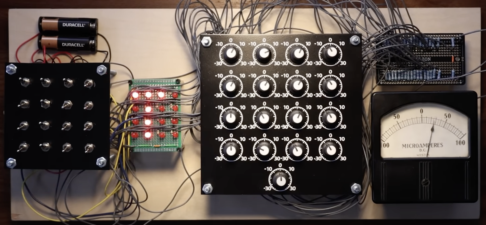

# Web Perceptron

* Implement the Perceptron on a website using either JavaScript or PyScript with Python
* link

## A visual example



## PyScript Examples

* https://github.com/rcalix1/MachineLearningFoundations/tree/main/DeployToWeb
* https://rcalix1.github.io/Build-Fun-AI-Projects-that-Run-on-the-Web/volume-1-pyscript-and-knn/chapter3/AppKNNiris/index2.html
* https://github.com/rcalix1/Build-Fun-AI-Projects-that-Run-on-the-Web/tree/main/volume-1-pyscript-and-knn/chapter3/AppKNNiris
* https://pyscript.com/@examples

## Python Code

* https://github.com/rcalix1/MachineLearningFoundations/blob/main/2025/InClassPerceptron.ipynb
* https://github.com/rcalix1/MachineLearningFoundations/tree/main/NeuralNets/perceptron
* 

## Code

```

import numpy as np

# -------------------------------------------------
# Example trained perceptron weights from Python
# -------------------------------------------------

weights = np.array([
    12,
    -6,
    3,
    -9
])

bias = 4


# -------------------------------------------------
# STEP 1:
# Normalize weights to [-1, 1]
# -------------------------------------------------

max_abs = max(
    np.max(np.abs(weights)),
    abs(bias)
)

weights_norm = weights / max_abs
bias_norm = bias / max_abs


# -------------------------------------------------
# STEP 2:
# Map [-1, 1] --> [0, 100]
#
# 0   = maximum negative
# 50  = zero
# 100 = maximum positive
# -------------------------------------------------

weights_pots = 50 * (weights_norm + 1)
bias_pot = 50 * (bias_norm + 1)


# -------------------------------------------------
# PRINT RESULTS
# -------------------------------------------------

print("Original weights:")
print(weights)

print("\nNormalized weights:")
print(weights_norm)

print("\nPotentiometer settings:")
print(weights_pots)

print("\nBias potentiometer:")
print(bias_pot)

```

and results 

```

Original weights:
[12 -6  3 -9]

Normalized weights:
[ 1.   -0.5   0.25 -0.75]

Potentiometer settings:
[100.   25.   62.5  12.5]

Bias potentiometer:
66.67


```

## “Liminal” = threshold between states

* The Liminal Engine
* 


## Circuit


```

5V
 |
Switch
 |
10k Pot
 |
1k resistor
 |
SUM BUS


```

and for the display 


```

5V
 |
330Ω
 |
LED
 |
Switch
 |
GND


```


and all neurons connected

```


Neuron 1 ----[1k]---+
Neuron 2 ----[1k]---+
Neuron 3 ----[1k]---+
                    |
Neuron 4 ----[1k]---+
                    |
        SUM BUS ----+---- Meter


```


## For both positive and negative weights


```

                 +---- 330Ω ---- LED ---- GND
                 |
5V --- Switch ---+
                 |
                 +---- 10k POT ---- SPDT SIGN SWITCH
                                      /      \
                                     /        \
                                    /          \
                             POSITIVE BUS   NEGATIVE BUS


```

and positive

```


Neuron 1 (+) ----[10k]----+
Neuron 2 (+) ----[10k]----+
Neuron 3 (+) ----[10k]----+
                          |
                          +---- POSITIVE BUS


```

and negative

```


Neuron 4 (-) ----[10k]----+
Neuron 5 (-) ----[10k]----+
Neuron 6 (-) ----[10k]----+
                          |
                          +---- NEGATIVE BUS


```

The extra 10k resistor prevents neurons from fighting each other


For the bias

```


5V
 |
10k POT
 |
SPDT SIGN SWITCH
 /      \
/        \
POS BUS  NEG BUS


```

LM358 Difference Stage

Use one op-amp inside the LM358.

Classic difference amplifier:


```

                  R1=10k
POS BUS ----/\/\/\-----+
                       |
                       |
                      (+)
                     LM358
                      (-)
                       |
                       |
NEG BUS ----/\/\/\-----+
                  R1=10k


```


feedback


```


Output ----/\/\/\----+
          R2=10k     |
                     |
                     +---- (-)


```


## Full specs 

one neuron

```


                    +----330Ω----LED----GND
                    |
5V----INPUT SWITCH--+
                    |
                    +----10k POT----CENTER OF SPDT

                                   SPDT ON-ON
                              +-------o POS BUS
                              |
 POT OUTPUT ------------------o
                              |
                              +-------o NEG BUS


```


Bias Neuron

Same thing but always ON


```


5V----10k POT----CENTER OF SPDT

                    SPDT ON-ON
               +-------o POS BUS
               |
 POT OUTPUT ---o
               |
               +-------o NEG BUS


```


Proper LM358 Difference Amplifier

Use four equal resistors.

All four are 10k.


```

       LM358
     +--------+
 1 OUT1      8 VCC (+5V)
 2 IN1-      7 OUT2
 3 IN1+      6 IN2-
 4 GND       5 IN2+
     +--------+


Pin 1 = Output
Pin 2 = Negative input (-)
Pin 3 = Positive input (+)
Pin 4 = GND
Pin 8 = +5V


```


positive bus


```

                 R1=10k
POS BUS ----/\/\/\/\/\-----+
                           |
                           |
                         Pin 3 (+)
                           |
                           |
                          R2=10k
                           |
                           |
                          GND


```

negative bus


```

                 R3=10k
NEG BUS ----/\/\/\/\/\-----+
                           |
                           |
                         Pin 2 (-)
                           |
                           |
                 R4=10k
                           |
                           |
Pin1 OUTPUT ----/\/\/\/\/\-+


```

Full Diagram

```


                         +5V
                          |
                          |
                        LM358
                     Pin8   Pin4
                      |      |
                      |     GND


                 10k
POS BUS ----/\/\/\/\/\-----+
                           |
                           |
                        Pin3 (+)
                           |
                           |
                 10k       |
                           |
                           |
                          GND


                 10k
NEG BUS ----/\/\/\/\/\-----+
                           |
                           |
                        Pin2 (-)
                           |
                           |
                 10k       |
                           |
                           |
Pin1 OUTPUT ----/\/\/\/\/\-+


NEG BUS ---- 10k ----+
                     |
                     +---- Pin 2 (-)
                     |
OUTPUT ---- 10k -----+


                 Pin 2 (-)
                     |
                     |
          +----------+----------+
          |                     |
          |                     |
       10k                    10k
          |                     |
          |                     |
      NEG BUS              OUTPUT


                 Pin1 Output
                      |
                      |
          +-----------+-----------+
          |                       |
          |                       |
      Meter +                  10k
                                  |
                                  |
                               Pin2 (-)


```


Meter Connection

The meter connects directly to the output.


```


LM358 Pin1 OUTPUT ------ Meter +

Meter - --------------- GND


```


