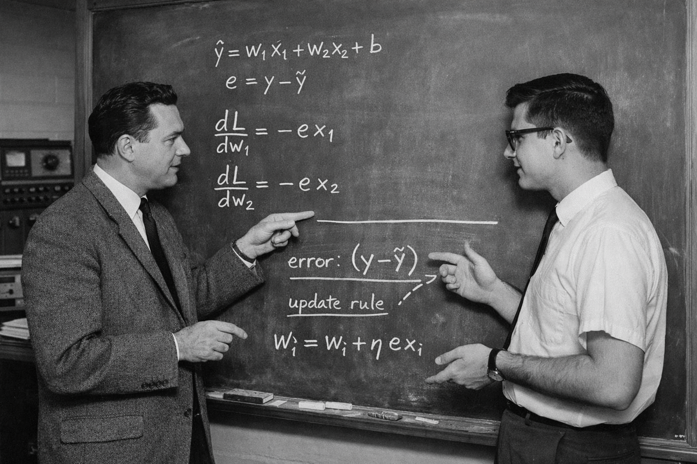

## XOR

* https://github.com/rcalix1/MachineLearningFoundations/blob/main/NeuralNets/PyTorch/FoundationsOfNeuralNetworks_gradients_XOR.ipynb
* Cover SVM too since it uses XOR data: https://github.com/rcalix1/MachineLearningFoundations/tree/main/SVM

## Derivative

## Squared Error Gradient (Simple)

### Start

$$
L = (wx + b - y)^2
$$

---

### Rule

$$
\frac{d}{dw} \left( (\text{something})^2 \right)
= 2(\text{something}) \cdot \frac{d}{dw}(\text{something})
$$

---

### Apply to $w$

$$
\frac{dL}{dw}
= 2(wx + b - y) \cdot \frac{d}{dw}(wx + b - y)
$$

---

### Inner derivative

$$
\frac{d}{dw}(wx + b - y) = x
$$

---

### Final

$$
\frac{dL}{dw} = 2(wx + b - y)x
$$

---

### Simple idea

$$
\text{error} = (wx + b - y)
$$

$$
\text{gradient} = 2 \cdot \text{error} \cdot x
$$

---
---
---

## Derivative of the Perceptron

## Widrow–Hoff (1959) Perceptron / Delta Rule

### Start

$$
\hat{y} = w x + b
$$

---

### Loss (linear error, no square written explicitly in form)

$$
L = (y - \hat{y})^2
$$

---

### Rule

$$
\frac{d}{dw} ( \text{something} )^2
= 2(\text{something}) \cdot \frac{d}{dw}(\text{something})
$$

---

### Apply to $w$

$$
\frac{dL}{dw}
= 2(y - \hat{y}) \cdot \frac{d}{dw}(y - \hat{y})
$$

---

### Inner derivative

$$
\frac{d}{dw}(y - \hat{y}) = -\frac{d}{dw}(w x + b) = -x
$$

---

### Combine

$$
\frac{dL}{dw}
= 2(y - \hat{y})(-x)
$$

$$
= -2(y - \hat{y})x
$$

---

### Same form (clean)

$$
\frac{dL}{dw} = 2(\hat{y} - y)x
$$

---

## Gradient Descent Update

$$
w := w - \eta \frac{dL}{dw}
$$

---

### Substitute

$$
w := w - \eta \cdot 2(\hat{y} - y)x
$$

---

### Absorb constant into learning rate

Let:

$$
\eta' = 2\eta
$$

---

### Final (Widrow–Hoff rule)

$$
\boxed{
w := w - \eta ( \hat{y} - y ) x
}
$$

$$
\boxed{
b := b - \eta ( \hat{y} - y )
}
$$

---

## 🔑 Simple idea

$$
\text{update} = -\eta \cdot (\hat{y} - y) \cdot x
$$

---

## 🧠 One sentence

> Move weights in proportion to the error and the input.

---
---
---

## Widrow–Hoff (1959) — Two Inputs

### Start

$$
\hat{y} = w_1 x_1 + w_2 x_2 + b
$$

---

### Error

$$
e = y - \hat{y}
$$

---

### Loss

$$
L = e^2
$$

---

### Rule

$$
\frac{d}{dw}(e^2) = 2e \cdot \frac{de}{dw}
$$

---

## Derivative w.r.t $w_1$

$$
\frac{de}{dw_1}
= -\frac{d}{dw_1}(w_1 x_1 + w_2 x_2 + b)
= -x_1
$$

$$
\frac{dL}{dw_1}
= 2e(-x_1)
= -2(y - \hat{y})x_1
$$

---

## Derivative w.r.t $w_2$

$$
\frac{de}{dw_2}
= -\frac{d}{dw_2}(w_1 x_1 + w_2 x_2 + b)
= -x_2
$$

$$
\frac{dL}{dw_2}
= 2e(-x_2)
= -2(y - \hat{y})x_2
$$

---

## Gradient Descent Update

$$
w_1 := w_1 - \eta \frac{dL}{dw_1}
= w_1 + \eta (y - \hat{y}) x_1
$$

$$
w_2 := w_2 - \eta \frac{dL}{dw_2}
= w_2 + \eta (y - \hat{y}) x_2
$$

$$
b := b + \eta (y - \hat{y})
$$

---

## 🔑 Final Form (what students remember)

$$
\boxed{
w_i := w_i + \eta (y - \hat{y}) x_i
}
$$

---

## 🧠 Simple idea

$$
\text{update for each weight} = \text{error} \times \text{its input}
$$

