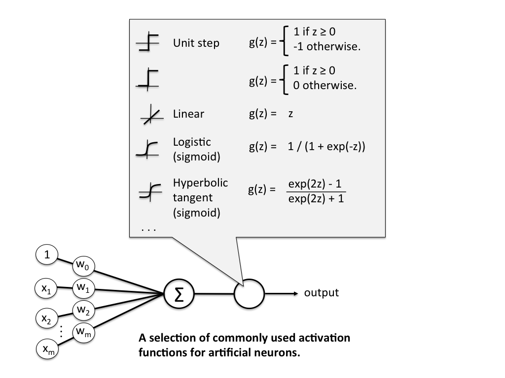
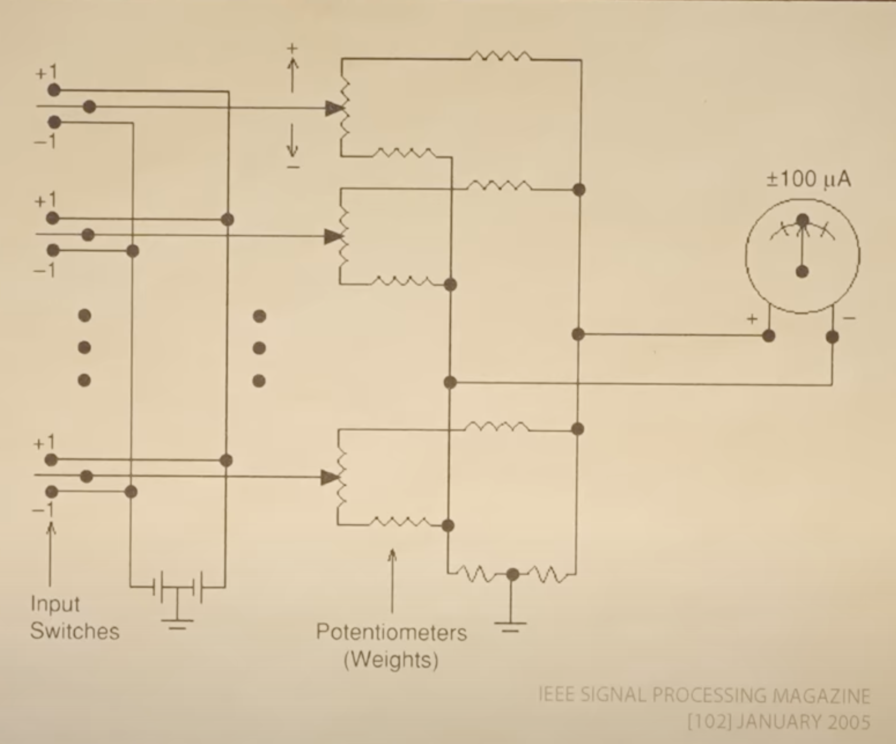
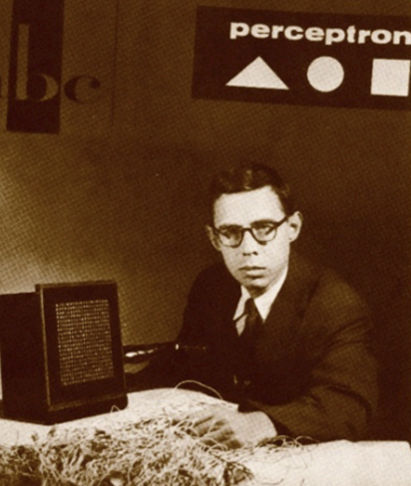

## The Perceptron

The perceptron was invented in 1943 by McCulloch and Pitts. The first implementation was a machine built in 1958 at the Cornell Aeronautical Laboratory by Frank Rosenblatt, funded by the United States Office of Naval Research. (From wikipedia)

In a 1958 press conference organized by the US Navy, Rosenblatt made statements about the perceptron that caused a heated controversy among the fledgling AI community; based on Rosenblatt's statements, The New York Times reported the perceptron to be "the embryo of an electronic computer that [the Navy] expects will be able to walk, talk, see, write, reproduce itself and be conscious of its existence."

Although the perceptron initially seemed promising, it was quickly proved that perceptrons could not be trained to recognise many classes of patterns. This caused the field of neural network research to stagnate for many years, before it was recognised that a feedforward neural network with two or more layers (also called a multilayer perceptron) had greater processing power than perceptrons with one layer (also called a single-layer perceptron).

Single-layer perceptrons are only capable of learning linearly separable patterns. For a classification task with some step activation function, a single node will have a single line dividing the data points forming the patterns. More nodes can create more dividing lines, but those lines must somehow be combined to form more complex classifications. A second layer of perceptrons, or even linear nodes, are sufficient to solve a lot of otherwise non-separable problems.

In 1969, a famous book entitled Perceptrons by Marvin Minsky and Seymour Papert showed that it was impossible for these classes of network to learn an XOR function. It is often believed (incorrectly) that they also conjectured that a similar result would hold for a multi-layer perceptron network. However, this is not true, as both Minsky and Papert already knew that multi-layer perceptrons were capable of producing an XOR function. 

Nevertheless, the often-miscited Minsky/Papert text caused a significant decline in interest and funding of neural network research. It took ten more years until neural network research experienced a resurgence in the 1980s. (from wikipedia)

## Consider the perceptron as illustrated in the figure above.

Consider:

If the activation function is linear, i.e. the first three cases, then the perceptron is equivalent to a linear classifier.
However, consider:

Is the perceptron equivalent to a non-linear classifier if its activation function is sigmoid?

In other words:

Can the perceptron represent any complex function, if using sigmoid as its activation function?

## Answer

The network in the diagram has an input layer and an output layer, but no hidden layers. 

This type of network can't perform nonlinear classification or implement arbitrary nonlinear functions, regardless of the choice of activation function.

However, things change radically once the network contains at least one hidden layer with sigmoidal (or other nonlinear) activation function. Such a network can indeed perform nonlinear classification and approximate arbitrary functions (but doing so may require adding vastly more units to the network). This is a consequence of the universal approximation theorem.

## Hardware Perceptron

* https://www.youtube.com/watch?v=l-9ALe3U-Fg&t=41s
* Perceptron Circuit
* https://ieeexplore.ieee.org/stamp/stamp.jsp?arnumber=1407720
* 

## Timeline

* 1943 by McCulloch and Pitts
* 1958 - Rosenblatt - Perceptron Learning rule - implemented

  
* 1959 - Bernard Widrow and Ted Hoff - calculus and gradients

  
* 1962 - Proof by Albert Novikoff
* late 1960's - Minsky
* 1984 - Hinton

## Proof

* 1962 - Proof by Albert Novikoff
* https://cs.uwaterloo.ca/~y328yu/classics/novikoff.pdf
* https://www.youtube.com/watch?v=kObhWlqIeD8
* 

## Notable papers

* David E. Rumelhart, Geoffrey E. Hinton & Ronald J. Williams. (1986) Learning representations by back-propagating errors. Nature 323, 533–536. (http://www.cs.utoronto.ca/~hinton/absps/naturebp.pdf)
* Nitish Srivastava, Geoffrey Hinton, Alex Krizhevsky, Ilya Sutskever, Ruslan Salakhutdinov. (2014). Dropout: A Simple Way to Prevent Neural Networks from Overfitting. 15(56):1929−1958, 2014. (https://jmlr.org/papers/volume15/srivastava14a/srivastava14a.pdf)
* Kurt Hornik, Maxwell Stinchcombe, Halbert White. (1989). Multilayer feedforward networks are universal approximators. Neural Networks
Volume 2, Issue 5, 1989, Pages 359-366.  (https://www.cs.cmu.edu/~epxing/Class/10715/reading/Kornick_et_al.pdf)
* Hongzhou Lin, Stefanie Jegelka. (2018). ResNet with one-neuron hidden layers is a Universal Approximator. NIPS (https://papers.nips.cc/paper/2018/file/03bfc1d4783966c69cc6aef8247e0103-Paper.pdf)

* Rumelhart, D. E., Mcclelland, J. L. (1987). Parallel Distributed Processing, Volume 1: Explorations in the Microstructure of Cognition: Foundations. United Kingdom: Penguin Random House LLC.
* Talking Nets: An Oral History of Neural Networks. (2000). United Kingdom: MIT Press.
* Cat and dog face dataset: https://www.kaggle.com/datasets/andrewmvd/animal-faces?resource=download
* Minsky, M., Papert, S. (2017). Perceptrons: An Introduction to Computational Geometry. United Kingdom: MIT Press.

