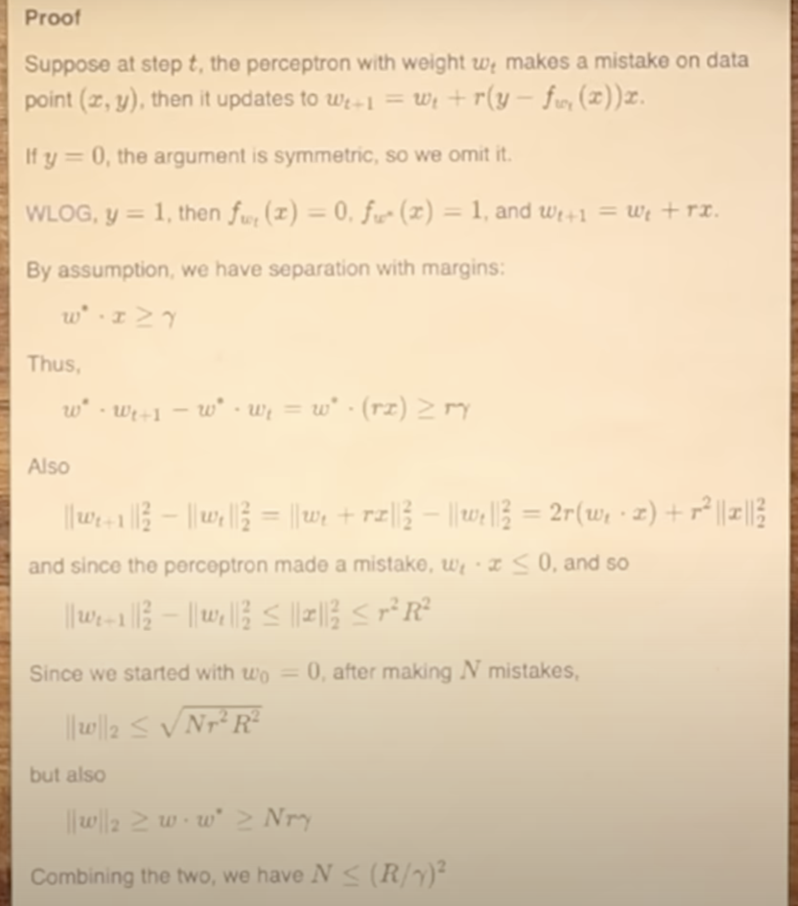

## The Perceptron

* Some Background: https://github.com/rcalix1/MachineLearningFoundations/blob/main/NeuralNets/README.md
* 

## Timeline

* 1958 - Rosenblatt - Perceptron Learning rule
* 1962 - Proof by Albert Novakok
* 1957 - calculus and gradients
* 1984 - Hinton

## Proof

## Papers

* Rumelhart, D. E., Mcclelland, J. L. (1987). Parallel Distributed Processing, Volume 1: Explorations in the Microstructure of Cognition: Foundations. United Kingdom: Penguin Random House LLC.
* Talking Nets: An Oral History of Neural Networks. (2000). United Kingdom: MIT Press.
* Cat and dog face dataset: https://www.kaggle.com/datasets/andrewmvd/animal-faces?resource=download
* Minsky, M., Papert, S. (2017). Perceptrons: An Introduction to Computational Geometry. United Kingdom: MIT Press.

